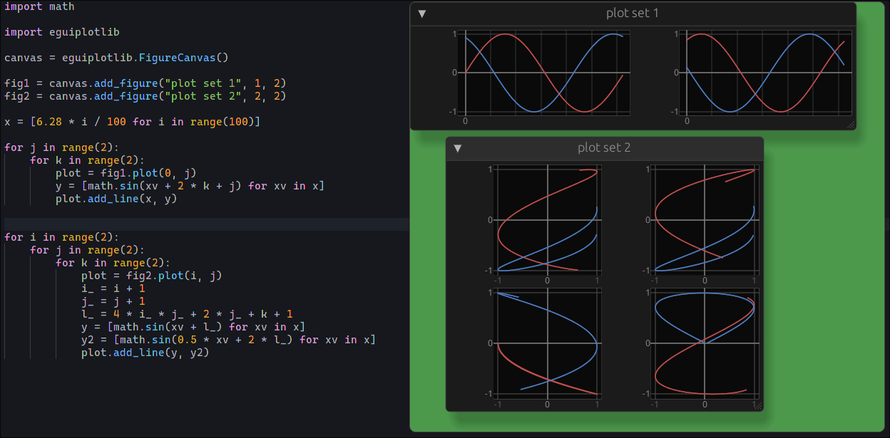

# EguiPlotLib

Proof of concept (extremely bare-bones), pyo3/egui line plotter, in the style of matplotlib.

To use, symlink the produced cdylib `ln -s $CARGO_TARGET_DIR/release/libeguiplotlib.so eguiplotlib.so` to a directory with a python script in it, from which it will then be available for import with `import eguiplotlib`.
